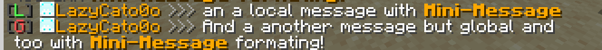

This is just another lazy-plugin which can made your chat experience better

##### Also, available on SpigotMC - [LazyChat on SpigotMC](https://www.spigotmc.org/resources/lazychat.130059/) and [on modrinth](https://modrinth.com/plugin/lazychat)
##### REQUIRES COMMANDS API - [CommandsAPI 11.0.0](https://github.com/CommandAPI/CommandAPI/releases/tag/11.0.0)
##### LATEST AT THIS MOMENT PUBLIC VERSION - v0.6

Only fully configurable chat-system with formating through MiniMessage

    # Local chat radius
    local-chat-radius: 100

    # Prefix for global chat (By default and most popular - "!")
    global-chat-prefix: "!"

    # log messages to console (by default on true)
    enable-console-logging: true

    # Messages examples. Placeholders: {player} - player-nickname, {message} - message, {prefix} - prefix from LuckyPerms (AT THIS MOMENT NOT SUPPORTED)
    # Example for global message.
    global-chat-format: "<dark_gray>|<green>G</green>|</dark_gray> <gold>{player}</gold> <gray>>>></gray> <white>{message}</white>"
    # Example for local message.
    local-chat-format: "<dark_gray>|<blue>L</blue>|</dark_gray> <gold>{player}</gold> <gray>>>></gray> <white>{message}</white>"

## Do is it support LuckyPerms prefixes?
### I think... I we it soon.

## What is "MiniMessage"?
### This is a formating api which provided from Adventure api (Or just Paper feature)
## How to build it?

### In Inteljl IDEA
`click at maven icon, after on "lifecycle" and on "package"`
### In CLI
`just go to project folder and open it with your command-line, after type "mvn package"`

#### BY [LAZYBOAT TEAM](https://github.com/lazyboatTEAM/)